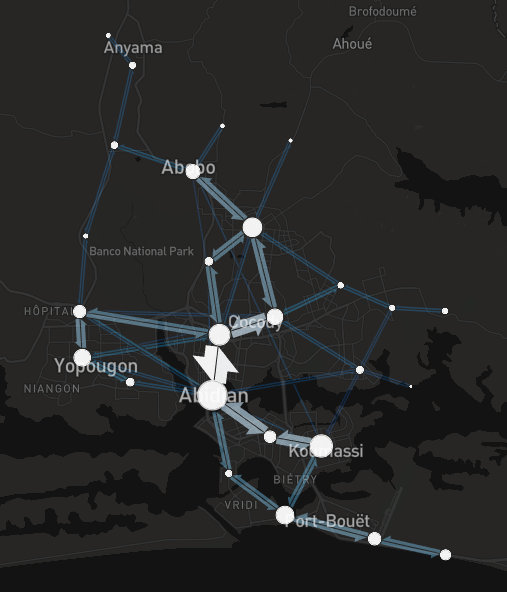

# od_volumes

Objectif : compter le nombre de passage de transport (pour un jour donné) entre chaque couple de points et générer une carte de flux

© Mapbox © les contributeurs d’OpenStreetMap - généré avec flowmap.blue

Le séquençage des arrêts est extrait d'OSM avec [osm_transit_extractor](https://github.com/CanalTP/osm-transit-extractor).
Le nombre de passage est également fourni par l'extrait osm_transit_extractor, avec un calcul pour passer de la fréquence au nombre de passage avec l'aide de la lib [transport-hours-py](https://github.com/Jungle-Bus/transport-hours-py).
